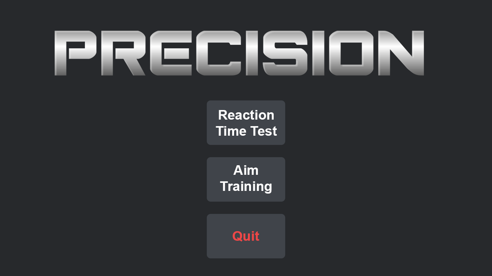
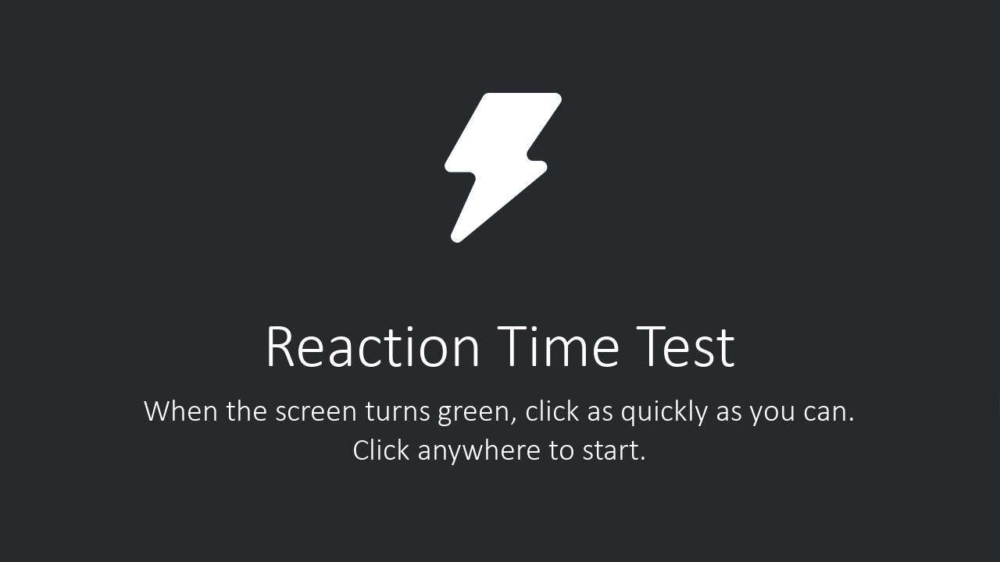

# Precision
## Created By
- Alexander McKillican
- Richard Morad
- Benjamin Sergnese

## About
This is essentially an app that will help train your hand eye coordination with a mouse, and your reaction time. The game consists of reaction time test and an aim trainer where you click targets as they appear, there will be 3 levels of difficulties for the aim trainer.

## Motivation
This project exists for a computer science class CPT

## Code style
We will use pygame to setup the game, and we will have a random number generator to decide the time it takes for the person to be prompted to react and use a time module to measure that time. We will write to a text file to store the best times and average times. We will also use a random number generator to randomly place targets and the time module to measure the time it takes to hit the next target. We will, again, store these values in a text file to keep track of them, and display them.

## Screenshots




## Tech/framework used

<b>Built with</b>
- Pycharm
- Pygame

## Features

- Reaction time test
- Aim trainer (W.I.P.)
- Local high score system (W.I.P.)
- Average scores (W.I.P.)

## Installation

To download the repository through command prompt (terminal on MacOS/linux), after cd'ing into the directory, run the command:
```git clone https://github.com/amckillican/Precision.git``` 
Once you have the repository downloaded, cd into the new folder and run the command: 
```python Precision.py```
