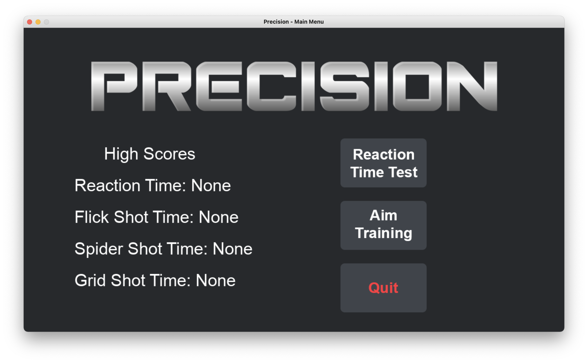
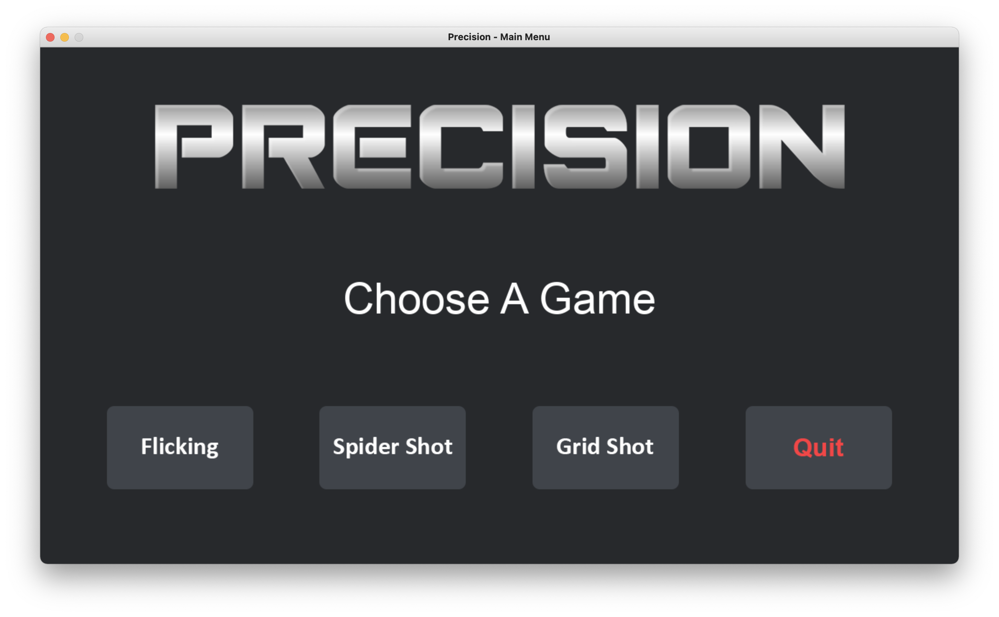
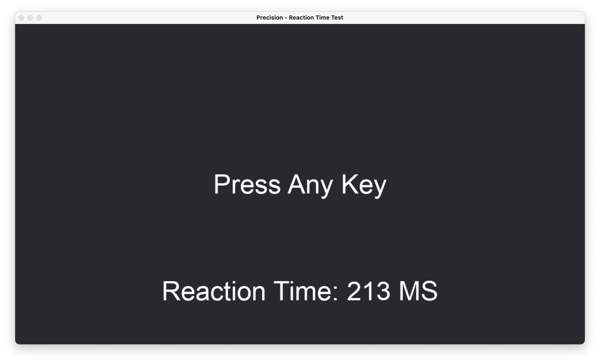
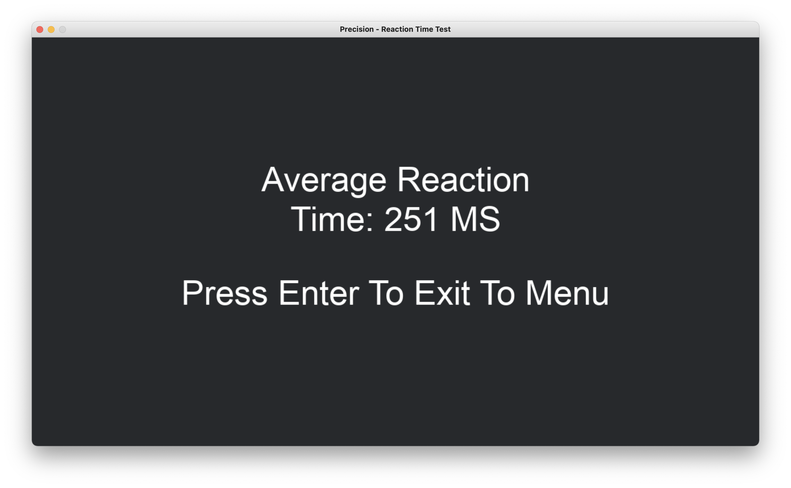
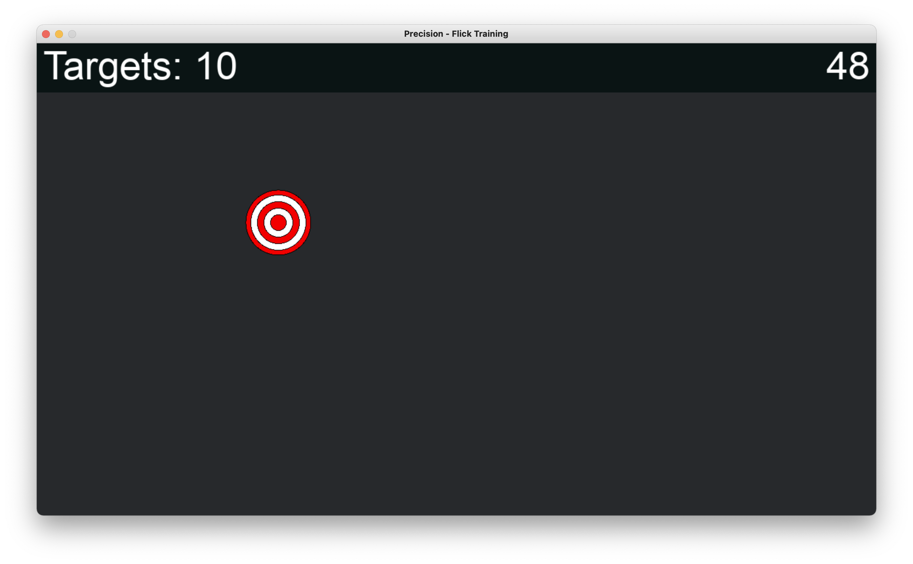
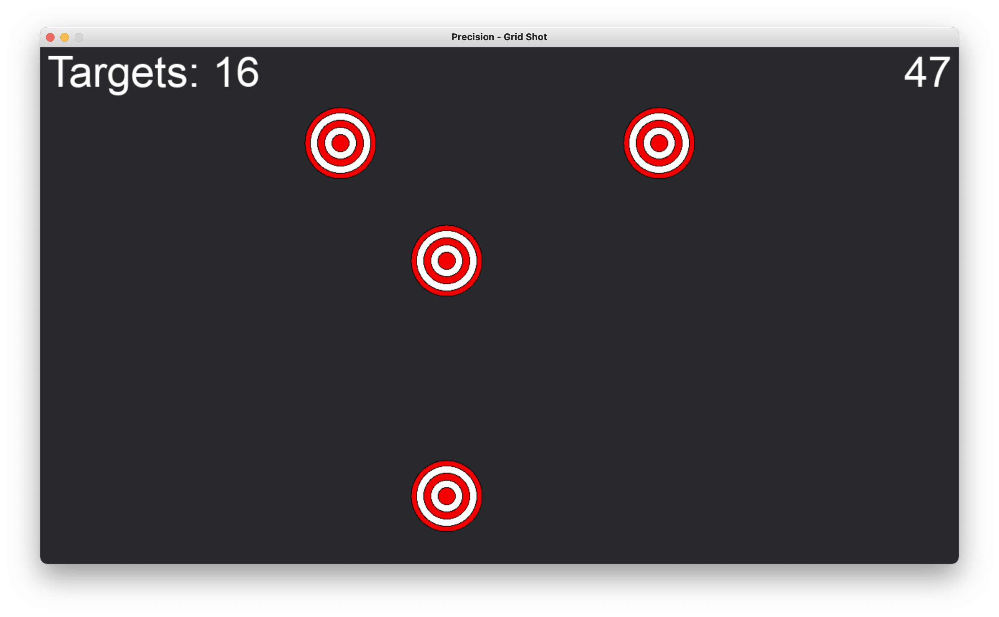
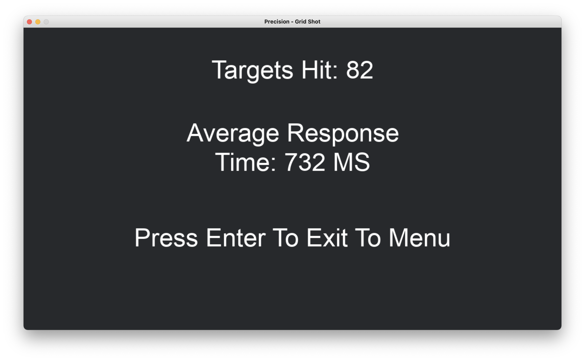

# Precision

## Table Of Contents
- [Created By](https://github.com/amckillican/Precision/blob/main/README.md#created-by)
- [About](https://github.com/amckillican/Precision/blob/main/README.md#about)
- [Code Style](https://github.com/amckillican/Precision/blob/main/README.md#code-style)
- [Tech/Framework Used](https://github.com/amckillican/Precision/blob/main/README.md#techframework-used)
- [Features](https://github.com/amckillican/Precision/blob/main/README.md#features)
- [Installation](https://github.com/amckillican/Precision/blob/main/README.md#installation)
- [Screenshots](https://github.com/amckillican/Precision/blob/main/README.md#screenshots)
- [Sources](https://github.com/amckillican/Precision#sources)

## Created By
- Alexander McKillican
- Richard Morad
- Benjamin Sergnese

## About
Precision is an app that will help train your hand-eye coordination, and your reaction time. The game consists of a reaction time test, and an aim trainer where you click targets as they appear. There will be three different modes for the aim trainer.

## Code style
We will use pygame to set up the game, and we will have a random number generator to decide how long to wait before prompting the user to react and measure that time. We will also randomly generate targets and measure the time it takes to hit the next target. We will use for loops to iterate through the user's inputs. We determine if a target needs to be displayed or if a key is being pressed based on the for loop. We will make use of functions to make our code easier to read and more concise.

## Tech/Framework Used

<b>Built with</b>
- Pycharm
- Pygame Module
- Random Module
- Openpyxl Module

## Features

- Reaction Time Test
- Aim Training
    - Flicking
    - Spider Shot
    - Grid Shot

## Installation
NOTE: Requires at least Python 3.9.5, Pygame, and Openpyxl to be installed.

To download and run the game, open command prompt (terminal on macOS/Linux) in the directory you want your game to be installed to and run the following commands:

```git clone https://github.com/amckillican/Precision.git```

```cd Precision```

Run this to open the game while in that directory:

```python Precision.py```

## Screenshots









## Sources
- [Pygame Documentation](https://www.pygame.org/docs/)
- [Openpyxl Documentation](https://openpyxl.readthedocs.io/en/stable/#)
- [Random Module Documentation](https://docs.python.org/3/library/random.html)
- [Story Blocks](https://www.storyblocks.com/)
